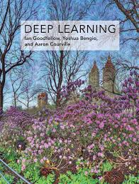
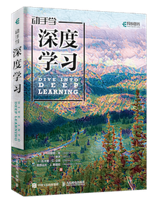
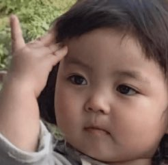

2024/11/07 part2

### AI学习初探

做为数字游民，一直在到处跑，一边见识下世界，一边也要不断干活（佛系创业｜探索）。

之前尝试的小程序因为腾讯对个人开发者的限制，有些功能做不了，一气之下我就不打算继续了，反正也是兴趣项目，都是个人投入，及时止损，不必非要为资本家做嫁衣。

ChatGPT展示的前景确实很诱人，要不跟LLM一起来学习ta自己吧！

于是我就问ChatGPT如何学习AI，不负所料ta也给出了ta的意见，推荐了书单，加上我平时经常刷Youtube，于是就开始动手了。

学习AI的过程可以不断和ChatGPT探讨，在看书的过程中遇到的各种概念，都可以请AI来解答，比如我会说：
please explain this concept to an IT professional who is not familiar with AI. (请把这个概念解释给一个不熟悉AI的IT人士)

遇到特别复杂的内容，暂时超出基础的范围，就把先把概念和框架先掌握了，然后继续后面的内容，这样会让学习快很多。

这个阶段一共看了3本书，很多YouTube视频。下面就对这几本书做个总结：

[*Neural Networks and Deep Learning*](http://neuralnetworksanddeeplearning.com/)
by Michael Nielsen

这本书免费，可以直接在作者的网站上阅读，不要钱义务科普，所以在官网上除了免费的内容和代码，还有打赏链接。

挺好，我要开始学习AI的精髓了。哈哈。🥰

结果，但是，一顿啃下来，发现，写得还行，示例的Python代码写得比较巧妙，里头有些内容我还结合了油管上一些印度博主的视频才搞明白。总而言之，言而总之，并没有让我弄得很清楚。

现在回看，这本书做为基础入门可能不是特别好。🥲

顺带说句，油管上印度博主蛮多的，有些内容质量真的还蛮不错。

---
 

[*Deep Learning : Adaptive Computation and Machine Learning series*](https://www.deeplearningbook.org/)
by Ian Goodfellow, Yoshua Bengio, and Aaron Courville

  

 
这本书是ChatGPT推荐的，号称花书（你看它的封面），作者里有2位都很很有名。

好棒棒，我终于要步入深度学习的殿堂了。🥰

但是，很快，我就发现，这本书并不适合初学者。

就像网友的评论一样，这本书介绍了不少架构的来源，什么来历，谁创造的，里面有很多数学公式，需要ChatGPT的大量配合才能大致弄明白，而且成书是2016年，大名鼎鼎的Transformer结构是2017年提出的，所以这本书稍微有点过时，而且也不太适合初学者。🥲
 

---
 

[*动手学深度学习（PyTorch版）*](https://zh-v2.d2l.ai/)
by 阿斯顿·张（Aston Zhang）、李沐（Mu Li）等

  

 
这本书初看是挺不错的，主创李沐是CMU的AI博士，在UCLA任教，在大厂的履历比较丰富。有很多高校都在采用这本教材。

太棒了，终于发现宝藏了，我兴奋地搓了搓小手。

  

 
不过，随着学习的推进，我很快发现，这本书更多是基于已有深度学习框架在讲，包括作者在亚马逊开发的MXNet深度学习框架。而不是在讲神经网络的原理。

对于想用框架进行应用开发的同学应该是比较合适的，但是想了解神经网络原理的同学可能需要找其他资料。而且MXNet项目后来也停止了。

  

 

---

### 后悔及庆幸

应该说，有点后悔以前上学时没有认真学习AI相关的内容。上学时有一门人工智能的课，在开始介绍部分老师就介绍了人工智能的历史，包括80年代及之后的寒冬，AI能做的非常原始，也没有见到什么像样的应用。所以学习的时候对这个方向兴趣不大。

当然那时也还没有AlexNet以及迅猛发展的10年，硬件速度也还有限。

但是也看过同一个群里的AI PhD们写的东西，其中讲到李开复时代用的三板斧在深度学习时代到来之后完全被淘汰，然后他们自己学的内容也很快过时。

所以，随着AI领域的迅速发展，时代把AI领域的PhD和非AI领域的其他人也一定程序上抹平了。

也就是说，现在开始，可能并不晚。