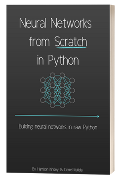

2024/11/07 part3

### 神经网络底层学习

在快速读过上述3本书以后，我对于AI的底层原理还是雾里看花，有点像当年刚学习计算机的我，会用键盘鼠标了，但是对于机器内部的运作还是一头雾水。

我感觉还需要学习更底层的内容，就像学习汇编一样。一些学习前端开发的非科班童鞋在学习编程时可能没有接触过C或者汇编这些底层的内容，更不会涉及硬件的模拟电路和数字电路，这不妨碍他们成为优秀的开发者。

不过对于新生而神奇的神经网络，像我这种爱打破砂锅问到底的人，还是希望了解得更底层一些。

当时Google也在发力研发自己的LLM，在试用的时候我问了ta如何学习AI底层原理的问题，于是ta给了推荐了下面这本书：

  

 

[*Neural Networks from Scratch in Python*](https://nnfs.io/)
by Harrison Kinsley

这本书的作者是Harrison Kinsley，他是一位资深的Python开发者，他坦言他在以前写相关程序的时候也并不知道其中的原理，但是他也一直好奇其中的原理，于是就有了这本书。

在这本书里，他把神经网络最基础的原理，包括神经元、激活函数（Sigmoid, ReLU）、损失函数（MSE, Categorical Cross-Entropy）、Softmax、梯度下降、反向传播等，都从数学层面进行了细致的解释。

### 学习历程

刚开始看这本书的时候应该是在泰国，前面的关于前向传播的内容都讲得非常清晰，但是，到反向传播这块，难度开始陡然上升了。应该说，这本书中间部分讲反向传播的部分是最需要静下心来慢慢推导的。个人当时一个困惑就是，到底是一组数据一起计算，还是一条数据进行一次计算。

因为签证快到期了，而且确实也想去其他没去过的地方，后来到了柬埔寨，第一站到了吴哥。因为时间比较充裕，就找了个安静的咖啡馆，用上纸笔开始把手工对反向传播进行推导。

一点一点地啃，包括链式法则(chain rule)，看各个油管博主的内容，把微积分捡起来重新一点点推导，最后花了10天时间把反向传播这个环节弄清楚了。

原理搞清楚以后就是写代码实现，应该说真正理解以后用代码来实现并不困难，更何况有ChatGPT帮忙，最后自己写出来的代码和书中的代码很多部分是类似的，但是反向传播里有个部分不太一样，不过测试的结果和书中结果基本一致。也许作者对python用得更熟练，可能他从执行效率上进行了一定优化。

最后才花了一天时间跑去著名的吴哥窟，逛了一整天。从早上6点多出发，步行超过6公里，把几个主要的景点都走了一遍。一直到晚上8点多才回。一整天可能步行了30公里以上。

应该说，吴哥窟名不虚传，既有有神奇的宗教色彩，又有历史的厚重感，非常值得一看。

而且那种把一个难题花较长时间啃下来后，再花一点时间去一个很棒的地方放松，真是很棒的体验。

后来去了柬埔寨首都金边，找了一个国家图书馆旁边的旅馆，每天去图书馆继续把这本书的后面部分完成了，并写了一些代码对梯度下降做了几种类型的验证。

### 书本评价

从自己以前的学习经历来看，凡事都要走弯路的，这次学习AI基础也不例外，可能这个领域本来就比较新，连续看了3本书后才发现这本，应该说，这本书就特别适合初学者，有点类似C和汇编语言的入门教程。

这本书并不免费，电子版定价29美元，纸质版更贵。相比之前有些免费的内容，应该算是价有所值。

不过需要坦白的是，我并没有掏这个钱，下的免费版本（不知道谁上传到Github的）。😅

对于想系统学习神经网络的童鞋，目前我会推荐它作为入门书籍。