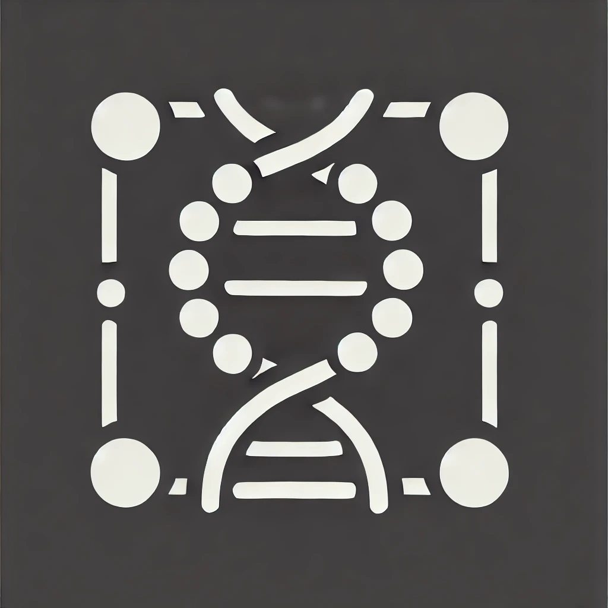

#  Computational-X-Interest-Group

# AI + Science X

- <a href="Neural_networks/README.md" style="font-size: 1.2em;">Neural Networks</a>

- <a href="Biology/README.md" style="font-size: 1.2em;">Computational Biology</a>

- <a href="Chemistry/README.md" style="font-size: 1.2em;">Computational Chemistry</a>

- <a href="Environmental/README.md" style="font-size: 1.2em;">Computational Environmental Science</a>

- <a href="Materials/README.md" style="font-size: 1.2em;">Computational Materials Science</a>

 

## Connect with members

- [GitHub Discussions](https://github.com/ee2k/Computational-X-Interest-Group/discussions/)
<!-- - Twitter Community (Under development)
[Computational-X](https://x.com/i/communities/xxxx) -->
