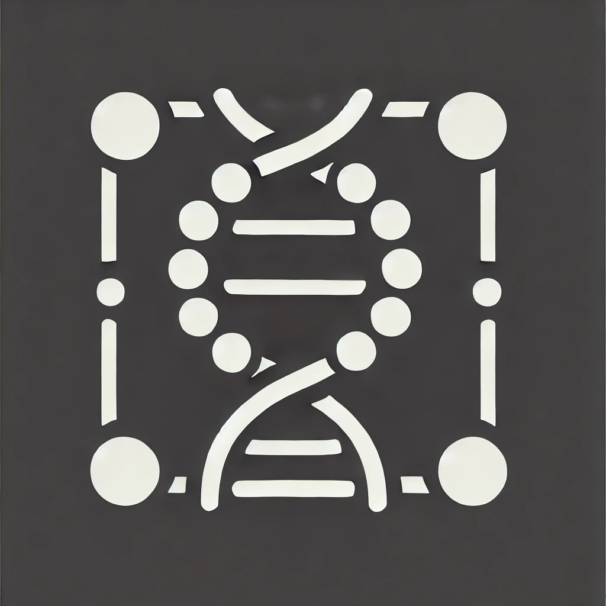

#  Computational-X-Interest-Group

## About This Project
This project aims to build a community for people who are interested in AI and its applications in various scientific fields (e.g., Biology, Chemistry, Environmental Science, Materials Science, etc.). It is a place for sharing resources, fostering discussions, and encouraging collaboration. 

I'm an indie maker and AI learner, and I'm quite interested in computational biology. My goal is to create a space where we can learn to build neural networks from scratch, explore their applications in sciences, and collaborate on innovative research and development.

The journey could be tough, but very interesting and rewarding in the long run. I invite you to contribute your knowledge, engage with like-minded members and learn from each other, and participate in projects.

# AI + Science X

- <a href="Neural_networks/README.md" style="font-size: 1.2em;">Neural Networks</a>

- <a href="Biology/README.md" style="font-size: 1.2em;">Computational Biology</a>

- <a href="Chemistry/README.md" style="font-size: 1.2em;">Computational Chemistry</a>

- <a href="Environmental/README.md" style="font-size: 1.2em;">Computational Environmental Science</a>

- <a href="Materials/README.md" style="font-size: 1.2em;">Computational Materials Science</a>

 

## Connect with members

- [GitHub Discussions](https://github.com/ee2k/Computational-X-Interest-Group/discussions/)
- Twitter Community (Under development)
<!-- [Computational-X](https://x.com/i/communities/xxxx) -->
